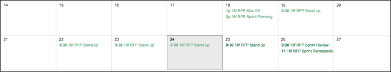

# FDA PharmaQuery #

Our <a href="https://openfda.ctacdev.com" target="_blank">working prototype</a>.

## Description ##

Our Agile/Scrum certified development team followed an agile methodology to iteratively design, develop, implement, test, and improve requirements in short iterations.  Our design and development process allowed stakeholders to provide constructive feedback and ensures transparency in every step of the development process.

In forming the 18F Prototype Team, CTAC’s agile/scrum coach identified resources and held an internal kickoff with team members to collaboratively decide who would take the team lead responsibilities that included monitoring timely completion of tasks, assessing the quality of work utilizing the Gitflow process of code commits and reviews, as well as ensuring adequate documentation.

To establish the technical vision for this project, the Team began by brainstorming and made decisions based on what data the OpenFDA API made available, what ways we thought the data could be visually interesting, and what could be useful to audiences that would likely be consuming the data. Using this information as a foundation for the technical frameworks, we decided to use Ruby on Rails for its strong API-friendly framework, flexibility for reuse and sustainability.  For the front-end we used technologies such as Handlebars.JS.  Insight gathered from potential users such as nurses, healthcare providers and others illustrated a need to provide health related information in a meaningful way.  In today’s environment, social habits have changed and users want to use technology to help them become more knowledgeable about health conditions to make informed decisions regarding their health (even sometimes acting as their own physicians) in a simple and intuitive way. To meet the needs of these users, as well as our own goals of interactivity and meaningful data display, we decided to use visualization tool, D3. We chose D3 over several others we have used in the past (such as Morris charts) because it displays information in an interactive way and is flexible, reliable and allowed us to create custom code to make PharmaQuery responsive which is a main focus in any of our builds.

For this project, each sprint cycle included sprint planning (meaningful user stories, backlog prioritizations, release planning), daily 15 minute “standups” (quick reviews of tasks, flagging of impediments), and sprint reviews (demos/review of accomplishments, retrospectives/suggestions for continuous improvement). The calendar below represents a sample schedule of our daily tasks, sprint planning, and retrospectives:

Utilizing Test Driven Development (TDD) practices is standard at CTAC as defined in our CTAC Playbook. As part of this project, each developer began by writing a unit test, using RSpec for Ruby/Rails or QUnitJs for Javascript, for the task they picked up to ensure the goals of the task were fulfilled. Once the unit test was written, the coding effort began with the focus of passing the unit test. The code was adjusted until the test had been passed and the developer moved on to the next task.
As developers completed tasks and passed their automated tests, our GitFlow process and Code Review standards were monitored by the project lead. Commit messages were created by each team member for their code as it was checked into their feature branch and a pull request within the GitHub repository was created.

Automated code tools were deployed that we integrated with our Slack channel.  The majority of work was done in a “war room.”  All team members were kept up to date and collaborated via slack and google hangouts.

The app was “containerized” using Docker, enabling members of the team to easily check out the project and fire up a complete working instance with a simple command. Once a release was cut (tests pass, code pushed, a version number chosen, tagged, and merged into the master repository), the Jenkins Continuous Integration server automatically deployed the container to Amazon Elastic Beanstalk. Amazon Services used the Dockerfile included in the project to build and deploy a new production version of the application automatically in just minutes. This approach is known as a continuous delivery platform (extremely short intervals between feature request and production release).  

As we approached the end of the sprint, the team prepared a demo of the tasks accomplished to the Product Owner and Stakeholders to gain feedback (requirement sign-off, updated requirements, new features). The Product Owner entered tasks into the backlog to groom and prioritize with the Stakeholders, which was the basis of the next sprint iteration.  In completing the sprint, a retrospective, facilitated by our Agile Coach, was held with the team to review the process and gain feedback from the team to continually look for process improvements.

<em><strong>References in addition to the 750 word Description (reference page 17 of solicitation: “The README.md file should also make reference to the following…”)</strong></em>

a. Assigned one leader and gave that person authority and responsibility and held that person accountable for the quality of the prototype submitted:  <em><strong>As part of our agile process, CTAC assigned a prototype project leader with the authority and responsibility for the development of the 18F Agile prototype, including accountability for the timely release and quality of the product.</strong></em>

b. Assembled a multidisciplinary and collaborative team that includes at a minimum three of the labor categories limited to the Design Pool Labor categories to design the prototype as quoted in Attachment C. The quoter’s proposed mix of labor categories and level of effort for its working prototype, as reflected in Attachment C, shall be evaluated to assess the quoter’s understanding and capability to supply agile delivery services:  <em><strong>CTAC’s prototype project leader, with assistance from our Project Management Office, assembled a multidisciplinary team and with the skills required in the solicitation.  As a first step in the prototype project planning, we analyzed project requirements and develop a staffing plan, and then populated the team staff having the appropriate skill mix.  Our staffing is based on our 22+ years of experience supporting similar projects for our Government and private sector clients. For the design effort, we used the following labor categories: Technical Architect, Frontend Web Developer, Backend Web Developer, and DevOps Engineer.  (See Attachment C - Price Quote Sheet (submitted through eBuy).</strong></em>

c. Used at least five modern and open-source technologies, regardless of architectural layer (frontend, backend etc):  <em><strong>CTAC used Ruby, Ruby on Rails, Bootstrap, Sass, jQuery, jQuery UI, D3.js, Handlebars.js, MySQL, SQLite, RSpec, QUnit, Jenkins, Docker for this prototype.</strong></em>

d. Deployed the prototype on an Infrastructure as a Service (IaaS) or Platform as a Service (PaaS) provider, and indicated which provider was used: <em><strong>CTAC used Amazon Web Services: Elastic Beanstalk, S3, Cloudwatch, Cloudfront, EC2.</strong></em>

e. Wrote unit tests for their code: <em><strong>Utilizing Test Driven Development (TDD) practices is standard at CTAC; as part of this project, each developer began by writing a unit test for the tasks they picked up to help ensure the goals of the task were fulfilled. Once the unit test was written, the coding effort began with the focus of passing the unit test. The code was then adjusted until the test has been passed and then developer moved on to the next task.</strong></em>

f. Set up or used a continuous integration system to automate the running of tests and continuously deployed their code to their IaaS or PaaS provider:  <em><strong>CTAC used Jenkins for continuous integration and automated deployment.</strong></em>

g. Set up or used configuration management:  <em><strong>CTAC used Docker and Amazon Management Console for configuration management.</strong></em>

h. Set up or used continuous monitoring: <em><strong>We used Amazon Cloudwatch for continuous monitoring.</strong></em>

i. Deploy their software in a container (i.e., utilized operating-system-level virtualization): <em><strong>We deployed the software in Docker and Amazon Elastic Beanstalk.</strong></em>

j. Used an interactive approach, where feedback informed subsequent work or versions of the prototype: <em><strong>We chose one week sprints for this effort, including daily standups and sprint demos where product owners and stakeholders provide feedback for the backlog which was groomed and prioritized to set the foundation for iteration 2.</strong></em>

k. Provided sufficient documentation to install and run their prototype on another machine: <em><strong>The final portion of the quality check process we used tested the integrity of the application by installing and running it solely using the installation documentation and instructions provided to ensure that the customer is provisioned a dependency free deliverable that can be deployed into a fresh environment. Developer instructions have been provided in the README.md found at the root of the GitHub repository.</strong></em>

l. Prototype and underlying platforms used to create and run the prototype are openly
licensed and free of charge: <em><strong>Our prototype consists only of open source or public domain technologies. Licensing information for all open source technologies used has been provided in the README.md found at the root of the GitHub repository.</strong></em>

## Continuous Integration (CI) Server ##

Development Snapshot: 

[Build Radiator](http://ec2-54-175-101-110.compute-1.amazonaws.com/view/Radiator/)

### Reports
- [Test Report](http://ec2-54-175-101-110.compute-1.amazonaws.com/job/OpenFDA/lastCompletedBuild/testReport/)
- [Code Coverage Report](http://ec2-54-175-101-110.compute-1.amazonaws.com/job/OpenFDA/Code_Coverage_Report/)
- [Test History Analysis](http://ec2-54-175-101-110.compute-1.amazonaws.com/job/OpenFDA/test_results_analyzer/)

Stable Release: 

## Dependencies ##

This application requires:

- *NIX-based operating system
- Ruby 2.2.2
- Rails 4.2.1
- MySQL 5.5+

## Developer Setup ##

Assuming that the above dependencies are installed and MySQL is running:

    cd openfda_rfq/
    bundle install

Copy `config/*.yml.example` files to `config/*.yml`:

    for i in `ls config/*.example`; do cp -f $i `echo $i | sed "s/.example//g"`; done

Edit `database.yml` to ensure correct connection information for MySQL, then:

    rake db:setup import_active_ingredients
    rails s

Once Rails is running, you should be able to browse to <a href="http://localhost:3000" target="_blank">the local server</a>.

## Testing ##

Ruby/Rails tests are provided by [RSpec](http://rspec.info/). The test suite may be run by invoking `rspec` from the project directory.

The RSpec test suite is located in the `spec/` directory.

Javascript Unit tests are provided by [QUnitJs](http://qunitjs.com). Test reports can be accessed locally at <a href="http://localhost:3000/qunit" target="_blank">http://localhost:3000/qunit</a> in development.

Javascript tests are located in the `test/javascript/` directory.

## Containerized Deployment ##

Using containers ([Docker](https://www.docker.com)) enables the complete development or production environment to follow the code itself. Apps using docker can be pushed to Amazon Elastic Beanstalk directly, and used as a basis for auto-scaling load-balanced environments. The Docker setup of this app is broken into two parts: a local configuration using docker-compose, and a production configuration designed for use by Elastic Beanstalk in production.

### Local Container Setup ###

#### Background ####

- Development environment uses mysql
- Development is done primarily on Mac OS X
- Environment should be simple to launch & configurable

#### Setup Instructions ####

**Prerequisites**

- [homebrew](http://brew.sh)
- [git](https://git-scm.com)
- [docker](https://www.docker.com)
- [boot2docker](https://github.com/boot2docker/osx-installer/releases)
- [docker-compose](https://docs.docker.com/compose/)
- [The app](https://github.com/ctacdev/openfda_rfq) checked out and ready to run

**Configuration**

Development setup consists of three primary parts:

1. *Dockerfile* - Defines how container is setup, configured, and app is installed
2. *docker-compose.yml* - Defines the local docker container stack, links containers, and provides environment variables
3. *.env.<name>*  - where environment variables are stored.

The *Dockerfile* provides details on how to build the image

Since it is necessary to have slightly different configurations in dev vs prod (environment is different, asset pre-compilation should be enabled for prod, etc...) we can define two different Dockerfiles and distinguish between them in the docker-compose.yml (see below). The Dockerfile for the local development environment looks like this:

    FROM library/ruby:2.2.2

    RUN apt-get update -qq && apt-get install -y build-essential

    # for nokogiri
    RUN apt-get install -y libxml2-dev libxslt1-dev

    # for a JS runtime
    RUN apt-get install -y nodejs

    ENV APP_HOME /openfda
    RUN mkdir $APP_HOME
    WORKDIR $APP_HOME

    ADD Gemfile* $APP_HOME/
    RUN bundle install

    ADD . $APP_HOME

    CMD ["foreman", "start", "-e", ".env.web", "web"]

The container inherits the base ruby 2.2.2 image, which comes preconfigured with everything needed to run a started rails app. There are a few more container requirements (libraries, frameworks) and those are installed using apt-get from within the container at build time. After defining the app home directory, creating it, and declaring it the WORKDIR, the Gemfile is added and bundle is invoked to install app dependencies. Then the app code itself is added to the home directory. A default command is provided to enable running the app without docker-compose (straight docker).

The *docker-compose.yml* file defines the individual containers, and looks something like this:

	db:
      image: mysql
      ports:
        - "13306:3306"
      environment:
        - MYSQL_ROOT_PASSWORD=ABC123def

    web:
      dockerfile: Dockerfile-development
      build: .
      command: foreman start web
      ports:
        - "80:3000"
      links:
        - db
      volumes:
        - .:/openfda
      env_file:
        - '.env.web'

There are two containers defined, "db" and "web". In db, image defines which image the container is based (official mysql latest), ports exposes the mysql database port to the host (via port 13306 as not to conflict with any local 3306 mysql instances on host), and the environment key contains the initial root password for mysql.

The web container specifies an alternate Dockerfile (Dockerfile-development) on which build upon in development. This Dockerfile omits some of the production only procedures, like compiling static assets. The web container also specifies the location to find build files (local directory), the command to run when starting the container (in this case overriding the Dockerfile), the port bindings (listen on 80 and forward to 3000), other containers to link to (the database), which volumes to link to (for outside <-> inside container file linking), and which environment file to include. The env_file includes database connection details, and other settings for rails/puma.

**Running the App**

Starting up is simple, assuming all the prerequisites are installed, cd into the project directory, and fire up docker-compose:

    $ cd path/to/project
    $ docker-compose pull && docker-compose build && docker-compose up

If this is the first time the app has been run, or if you have recently updated the app and need to update the data model, make sure to run the appropriate rake tasks. This can be done from a second terminal session while the docker containers are running (with docker-compose).

    # create the database, and run a migration
    $ docker-compose run web bundle exec rake db:create db:migrate RAILS_ENV=development

    # import the initial data set:
    $ docker-compose run web bundle exec rake import_active_ingredients RAILS_ENV=development

The app will run until the session is closed or ctrl-c is input. If you want to run the app as a daemon, include the -d flag when running docker-compose up.

**Interacting with the App**
If using boot2docker (on Mac OS X or Windows), then the container stack itself is running on a virtual machine. To interact with the app, the IP of the machine is needed.

    $ boot2docker ip

This command will print the ip of the local container vm. Use it to interact with the app, for instance, in the browser we might navigate to: http://192.168.59.103

You can add an entry to your /etc/hosts file or use DNSmasq to create a host name for convenience.

### Production Container Setup ###

#### Background ####

The production setup is very similar to the development setup, except that docker-compose is not used. Since the target production environment is Amazon Elastic Beanstalk and Amazon provides it's own RDS (Relation Database Service), there is no need to include our own database container. We also need to do a few extra steps - modify the runtime command slightly to execute rails in the production environment mode, and precompile the static assets.

- Production environment uses Amazon RDS (mysql)
- Production environment is Amazon Linux
- Production deploy should be automatic

#### Setup Instructions ####

The production environment will make use of the default Dockerfile automatically:

    FROM library/ruby:2.2.2

    RUN apt-get update -qq && apt-get install -y build-essential

    # for nokogiri
    RUN apt-get install -y libxml2-dev libxslt1-dev

    # for a JS runtime
    RUN apt-get install -y nodejs

    # set app root
    ENV APP_HOME /openfda
    RUN mkdir $APP_HOME
    WORKDIR $APP_HOME

    # add gemfile and install gems
    ADD Gemfile* $APP_HOME/
    RUN bundle install

    # add all files
    ADD . $APP_HOME

    # precompile assets
    RUN bundle exec rake assets:precompile --trace RAILS_ENV=production

    # add assets
    ADD public $APP_HOME

    # tell amazon which port app uses
    EXPOSE 3000

    #run the app
    CMD ["foreman", "start", "-e", ".env.production", "web"]

The main differences here are the extra RUN command for asset pre-compilation, the addition of the EXPOSE command (a hint for Amazon for setting up an automatic nginx proxy 80->3000), and a production .env file containing the real production config information. This file is generated by our Jenkins CI server (an example can be found in the project root directory).

### CI Server Config ###

#### Background ####

- The CI server is [Jenkins](https://jenkins-ci.org).
- There should be separate development and production environments
- The development environment should run automated tests and report results
- The production environment should build the docker container and push to Amazon Elastic Beanstalk

#### Prerequisites ####

A public facing server with the following installed

- [JRE](http://www.oracle.com/technetwork/java/javase/downloads/jre8-downloads-2133155.html)
- [Jenkins](https://jenkins-ci.org)
- [EB CLI](http://docs.aws.amazon.com/elasticbeanstalk/latest/dg/eb-cli3.html)
- [Git](https://git-scm.com)

#### Development Setup ####

There are several Jenkins plugins that facilitate the building, testing, and reporting of rails projects that have been installed in addition to the default plugin set:

- Build Monitor Plugin
- CloudBees Docker Build and Publish plugin
- CloudBees Docker Hub Notification
- embeddable-build-status
- HTML Publisher plugin
- Rake plugin
- rbenv plugin
- ruby-runtime
- Slack Notification Plugin
- Test Results Analyzer Plugin

---

A Freeform Jenkins project was created and configured to monitor the github repo where the project code resides. Since this was a private repo, an SSH keypair was generated on github to allow jenkins access to the repo (read-only).

The rbenv plugin was used is declare the ruby environment to use, and to preinstall the bundler and rake gems.

Then a shell script is executed to prepare the config files and install required gems.

    #!/bin/bash

    #Prepare Environment
    export PATH="/usr/local/bin:$PATH"

    #config setup
    cp ~/railsAppConfigs/fda_rfq_database.yml.test config/database.yml
    cp ~/railsAppConfigs/fda_rfq_secrets.yml.test config/secrets.yml

    #dependency install
    bundle install

Finally, execute the rake tasks that both test the application and build reports (this is done with the rake task plugin).

     bundle exec rake ci:all spec

All important build messages are reported via email and Slack to interested parties.

### Automatic Release Deployment ###

Automated deployment (continuous delivery) is implemented with a second Jenkins project targeted specifically at release duties. The setup is identical to the development project with two exceptions:

1. The project monitors the /master branch instead of develop
2. The shell script task is responsible for building the docker container and deploying it instead of simply creating test reports

The shell script can be seen here:

    #!/bin/bash

    #Prepare Environment
    export PATH="/usr/local/bin:$PATH"

    #copy env files
    rm config/database.yml
    rm config/secrets.yml
    rm -rf .elasticbeanstalk
    cp -r ~/railsAppConfigs/fda_rfq.elasticbeanstalk .elasticbeanstalk
    cp ~/railsAppConfigs/fda_rfq_database.yml.production config/database.yml
    cp ~/railsAppConfigs/fda_rfq_secrets.yml.production config/secrets.yml
    cp ~/railsAppConfigs/fda_rfq.env.production .env.production

    #cleanup
    rm -rf log && mkdir log
    find . -type f -name *.example -delete

    #make a clean git commit to deploy
    git branch -D prodDeploy
    git branch prodDeploy
    git checkout prodDeploy
    git rm .gitignore
    git add -A
    COMMIT_MESSAGE=`git log -n 1 --oneline | cut -c 9-`
    git commit -m "$COMMIT_MESSAGE"

    #deploy app to Elastic Beanstalk
    echo "Beginning AWS Deploy"
    eb deploy openfdaprod3-env --timeout 60

    #Run Migrations
    CONTAINER_ID=`ssh -t -i ~/.ssh/rfq.pem ec2-user@ec2-54-175-201-115.compute-1.amazonaws.com -t sudo docker ps | awk '/aws_beanstalk/{ print $1 }'`
    echo "Container found: $CONTAINER_ID"
    ssh -t -i ~/.ssh/rfq.pem ec2-user@ec2-54-175-201-115.compute-1.amazonaws.com -t sudo docker exec $CONTAINER_ID bundle exec rake db:migrate RAILS_ENV=production
    echo "Migration Complete"

The highlight operations include:

1. Cleaning up after a previous build
2. Copying the config files from a static location on the server (these are the config files that define how the app should work on Amazon Elastic Beanstalk)
3. The EB CLI expects to be run on a clean git commit, but we've modified the repo, so branch and commit changes temporarily, preserving previous commit message.
4. Run EB CLI deploy command (this uses git archive to zip the project and push to s3)
5. Elastic Beanstalk will deploy the uploaded project automatically into a new staging Docker container and then cascade update all load balanced instances if staging was successful (otherwise changes are rolled back)
6. Connect to primary container and initiate production rake tasks

## Open Source Technologies Used ##

The baseline [Ruby on Rails](http://rubyonrails.org/) application <a href="http://www.opensource.org/licenses/MIT">(MIT License)</a> was generated with the [rails_apps_composer](https://github.com/RailsApps/rails_apps_composer) gem
<a href="http://www.opensource.org/licenses/MIT">(MIT License)</a> provided by the [RailsApps Project](http://railsapps.github.io/).

Leverages the [Bootstrap](http://getbootstrap.com) CSS framework <a href="https://github.com/twbs/bootstrap/blob/master/LICENSE">(MIT License)</a>.

The [Sass](http://sass-lang.com/) CSS extension language <a href="https://github.com/sass/sass/blob/stable/MIT-LICENSE">(MIT License)</a> is used for styling.

Uses components of [jQuery UI](http://jqueryui.com) <a href="https://github.com/jquery/jquery-ui/blob/master/LICENSE.txt">(jQuery Foundation MIT/CC0 License)</a>.

Renders visualization generated using the [D3.js](http://d3js.org/) visualization library <a href="https://github.com/mbostock/d3/blob/master/LICENSE">(BSD 3-Clause License)</a>.

Relational database services are provided by [MySQL](http://www.mysql.com/) in development and production (<a href="https://github.com/mysql/mysql-server/blob/5.7/README">GPLv2 / FOSS Exception</a>), and [SQLite](https://www.sqlite.org/) <a href="https://www.sqlite.org/copyright.html">(Public Domain)</a> in the continuous integration layer.

Ruby/Rails tests are provided by [RSpec](http://rspec.info/) <a href="https://github.com/rspec/rspec/blob/master/License.txt">(MIT License)</a>.

JavaScript unit tests are provided by [QUnit](http://qunitjs.com) <a href="https://github.com/jquery/jquery-ui/blob/master/LICENSE.txt">(jQuery Foundation MIT/CC0 License)</a>.

[Jenkins](https://jenkins-ci.org/) <a href="https://github.com/jenkinsci/jenkins/blob/master/LICENSE.txt">(MIT License)</a> provides continuous integration and delivery of successful candidate builds to the [Docker](https://www.docker.com/) container platform <a href="https://github.com/docker/docker/blob/master/LICENSE">(Apache v2)</a>.

License attribution has been preserved, where applicable, in the binary distribution.
